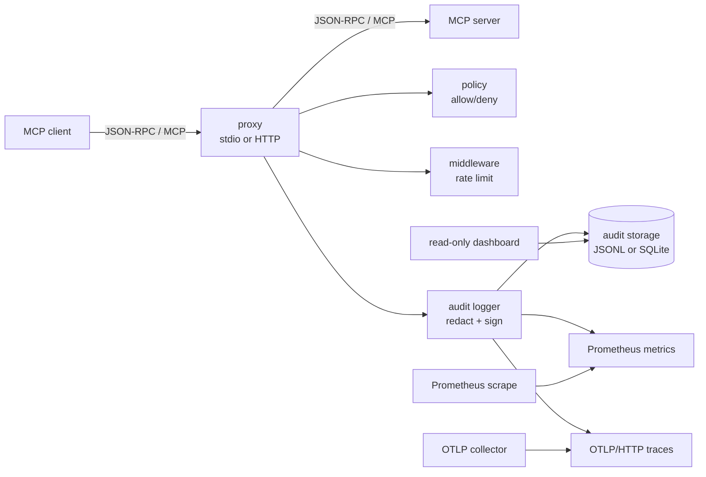

# Architecture

`mcp-audit` is a security and observability proxy for MCP servers. It is an
application, not a Go library: the CLI and documented runtime surfaces are
stable, while packages under `internal/` can evolve as implementation detail.
See `STABILITY.md:31` for the stable audit schema and `STABILITY.md:53` for the
explicit `internal/` boundary.

The architecture is intentionally small. The proxy must preserve JSON-RPC
traffic unless a configured policy or rate-limit rule intentionally rejects a
request. The durable evidence artifact is the signed audit row in JSONL or
SQLite; Prometheus metrics and OTLP spans are operational telemetry.

This document describes `mcp-audit` as of `v1.0.0`. File and line references
are accurate at the time of writing; function and package names are part of
the [stable surface](STABILITY.md), line numbers will drift as the code
evolves.

## Runtime Shape

The wiring lives in `cmd/mcp-audit/main.go`. Startup creates metrics and OTel
first (`cmd/mcp-audit/main.go:145`), opens the audit store
(`cmd/mcp-audit/main.go:165`), builds the redactor, policy engine and audit
logger (`cmd/mcp-audit/main.go:180`), then starts dashboard and metrics servers
beside the selected proxy transport (`cmd/mcp-audit/main.go:206`).

## Request Lifecycle

For an allowed `tools/call`, the proxy path is:

1. Read one JSON-RPC message from stdio or one HTTP request body. Stdio uses a
   bounded scanner for line-delimited JSON-RPC (`internal/proxy/stdio.go:202`);
   HTTP reads the request body before forwarding (`internal/proxy/http.go:142`).
2. Parse enough JSON-RPC structure to identify method, request ID and tool name.
   Parsing failures are logged and the message is forwarded as-is, preserving the
   zero accidental message drop invariant (`internal/proxy/stdio.go:212`,
   `internal/proxy/stdio.go:280`).
3. If the method is `tools/call`, evaluate policy first. A deny decision is
   audited and returned locally as JSON-RPC error `-32030`
   (`internal/proxy/stdio.go:221`, `internal/proxy/policy.go:10`).
4. Apply the per `(client_id, tool_name)` token bucket. A reject is audited and
   returned locally as JSON-RPC error `-32029`
   (`internal/proxy/stdio.go:238`, `internal/middleware/ratelimit.go:31`).
5. Forward the original message to the upstream server. For stdio this is a
   direct pipe to the child process (`internal/proxy/stdio.go:153`); for HTTP it
   is a rebuilt upstream request with copied headers and forwarded client IP
   context (`internal/proxy/http.go:186`, `internal/proxy/http.go:237`).
6. Match the upstream response back to the pending request ID and record the
   audit entry with duration, method, request ID, tool name, redacted params and
   result/error (`internal/proxy/stdio.go:304`, `internal/proxy/stdio.go:314`;
   HTTP does the same after reading the response body in
   `internal/proxy/http.go:175`).
7. The audit logger fills defaults, redacts payloads, signs, appends to storage,
   records metrics, and queues an OTLP span if configured
   (`internal/audit/logger.go:113`). Export failure is intentionally logged but
   does not make the audit write fail (`internal/audit/logger.go:146`).

Denied and rate-limited calls are still evidence: they go through
`audit.Logger.Record` before the proxy returns the local JSON-RPC error.

## Package Responsibilities

`cmd/mcp-audit/` is the composition root. It owns config loading, CLI flags,
runtime defaults, process signal handling, and construction of all internal
components. It is the only package that knows how storage, redaction, policy,
metrics, OTel and proxy transports are assembled together
(`cmd/mcp-audit/main.go:131`, `cmd/mcp-audit/main.go:528`).

`internal/proxy/` owns MCP traffic handling. `stdio.go` wraps a local upstream
process and coordinates two pipes with a stdout mutex so proxy-generated errors
do not interleave with upstream output (`internal/proxy/stdio.go:84`).
`http.go` implements the HTTP reverse-proxy path, upstream TLS support,
conservative retry, SSE streaming, and response observation
(`internal/proxy/http.go:142`). The package boundary consumed by `cmd/` is
`StdioConfig`, `HTTPConfig`, `NewStdioProxy`, `NewHTTPProxy`, `Run`, and
`ListenAndServe`.

`internal/audit/` defines the evidence model. `Entry` is the stable JSON schema
recorded by every store (`internal/audit/logger.go:27`), and `Store` is the
interface shared by storage backends, the dashboard, and wrappers
(`internal/audit/logger.go:45`). `Logger.Record` is the central write path:
redaction, signing, storage, metrics and trace queueing happen there in that
order (`internal/audit/logger.go:113`). `Signer` uses HMAC-SHA256 over the
stable signed field set (`internal/audit/signer.go:25`).

`internal/audit/storage/` contains persistence backends and wrappers. JSONL is
append-only and protected by a mutex around writes and reads
(`internal/audit/storage/jsonl.go:14`). SQLite initializes a simple indexed
schema and serializes batch transactions with a mutex
(`internal/audit/storage/sqlite.go:18`, `internal/audit/storage/sqlite.go:83`).
`AsyncStore` adds a bounded channel, batching, flush requests and sticky error
handling around any `audit.Store` (`internal/audit/storage/async.go:36`).
`InstrumentedStore` wraps writes with storage metrics without changing the
wrapped store's behavior (`internal/audit/storage/instrumented.go:14`).

`internal/policy/` is a synchronous allow/deny engine for `tools/call`. Rules
match client ID, server ID and tool name with exact values, wildcard `*`, or
empty fields (`internal/policy/policy.go:78`, `internal/policy/policy.go:116`).
The proxy depends on `policy.Engine.Evaluate` and converts deny decisions to the
stable JSON-RPC error in `internal/proxy/policy.go`.

`internal/middleware/` contains request-local protections. `RateLimiter` builds
one token bucket per `(client_id, tool_name)` under a mutex-protected map
(`internal/middleware/ratelimit.go:11`). `Redactor` unmarshals the payload to a
`map[string]any` tree, walks it, and replaces sensitive values when object keys
contain configured case-insensitive fragments such as `token`, `secret`, or
`authorization` (`internal/middleware/redact.go:8`,
`internal/middleware/redact.go:32`).

`internal/metrics/` owns Prometheus instrumentation and serving. The
`Recorder` interface is intentionally broad enough for proxy, audit, storage,
async and OTel events (`internal/metrics/recorder.go:28`). The concrete recorder
uses a dedicated Prometheus registry and stable `mcp_audit_*` metric names
(`internal/metrics/recorder.go:93`). Queue gauges use atomics because updates
come from worker goroutines (`internal/metrics/recorder.go:87`).

`internal/otel/` exports selected audit entries as OTLP/HTTP JSON without
depending on the OpenTelemetry SDK. Only `tools/call` entries are queued
(`internal/otel/exporter.go:154`), payloads are translated to OTLP JSON spans
(`internal/otel/exporter.go:321`), and project attributes live under
`mcp_audit.*` (`internal/otel/semconv.go:38`). The exporter owns its queue,
worker goroutine, retry policy and TLS-aware HTTP client
(`internal/otel/exporter.go:71`, `internal/otel/exporter.go:244`).

`internal/httpclient/` centralizes outbound HTTP client creation for upstream
HTTP MCP servers and OTLP export. It clones Go's default transport, applies a
timeout, supports custom root CAs, server name overrides, local insecure mode,
and optional mTLS client certificates (`internal/httpclient/client.go:27`).

`internal/retry/` centralizes bounded HTTP retry policy. It separates retry
budget from status/error classification, honors `Retry-After` in seconds or
HTTP-date form, and clamps delay to the caller's max interval
(`internal/retry/retry.go:14`, `internal/retry/retry.go:42`,
`internal/retry/retry.go:97`). The proxy supplies a narrower classifier than
OTel so `tools/call` remains never retried and upstream retries stay
conservative.

`internal/dashboard/` is a read-only HTTP view over the audit store. It exposes
`/`, `GET /api/entries`, and `GET /api/stats` from one server
(`internal/dashboard/server.go:31`). Query parameters are parsed into
`audit.QueryFilter`, and every read delegates to the configured store
(`internal/dashboard/server.go:86`, `internal/dashboard/server.go:101`).

## Key Design Choices

**HMAC-SHA256 signs the evidence field set.** The signature covers
`id + timestamp + method + tool_name + params` (`internal/audit/signer.go:30`).
Those fields bind identity, time, action, tool and original request parameters.
The signed field set is stable per `STABILITY.md:35`; changing it would make
historical verification ambiguous and therefore requires a major version bump.

**Proxy-emitted JSON-RPC error codes are stable.** Rate limiting uses `-32029`
and policy deny uses `-32030` (`internal/proxy/stdio.go:242`,
`internal/proxy/policy.go:10`). Clients, tests and dashboards can classify
intentional local enforcement without parsing error text. The codes are part of
the stable surface in `STABILITY.md:49`.

**OTel export avoids the SDK on purpose.** The exporter writes OTLP/HTTP JSON
directly (`internal/otel/exporter.go:321`) and keeps semantic attribute names in
one file (`internal/otel/semconv.go:1`). This keeps the binary small, avoids SDK
global state, and preserves audit independence: telemetry export is useful for
operations, but failed export never invalidates or blocks the durable audit row.

**Retry is conservative.** Upstream HTTP retries are disabled by default and
only apply when the request is safe to retry. `tools/call` is excluded because
the proxy cannot assume tool idempotency (`internal/proxy/http.go:268`). The
shared retry package handles backoff mechanics, while each caller owns its
retryability rules (`internal/retry/retry.go:25`).

**The dashboard is read-only.** The dashboard has no mutation endpoints:
`/api/entries` queries entries and `/api/stats` reads aggregates
(`internal/dashboard/server.go:86`, `internal/dashboard/server.go:101`). This
keeps the UI out of the evidence write path and avoids turning a local
inspection surface into an administration API.

## Concurrency Model

The proxy itself is concurrent by transport. Stdio runs separate goroutines for
client-to-server and server-to-client pipes, and serializes writes to client
stdout with `stdoutMu` (`internal/proxy/stdio.go:84`). Pending JSON-RPC calls are
stored in two maps protected by `rpcState.mu`; remember/take/purge operations all
hold that mutex (`internal/proxy/stdio.go:355`, `internal/proxy/stdio.go:407`).
HTTP delegates request concurrency to `net/http`; per-request pending state is a
local map, and shared state is pushed into concurrency-safe dependencies.

Storage writes are safe for concurrent callers. JSONL serializes append, query
and close through `JSONLStore.mu` (`internal/audit/storage/jsonl.go:15`).
SQLite serializes `AppendBatch` transactions with `SQLiteStore.mu`
(`internal/audit/storage/sqlite.go:18`, `internal/audit/storage/sqlite.go:88`).
That lock prevents concurrent transaction interleaving against one local SQLite
connection, which was one of the storage race classes fixed before v1.0.0.

Async storage has a single writer goroutine and a bounded queue
(`internal/audit/storage/async.go:69`, `internal/audit/storage/async.go:166`).
`Append` coordinates with `Close` through `closeMu`, checking `done` while the
read lock is held so a caller cannot send on a closed channel
(`internal/audit/storage/async.go:91`). Sticky write errors are guarded by
`errMu` and returned to later append/flush/query calls
(`internal/audit/storage/async.go:246`). This prevents the other pre-v1.0.0 race
class: appending while another goroutine is closing the async store.

The OTel exporter mirrors the same pattern for telemetry rather than evidence.
It owns a bounded channel, one worker goroutine, `sync.Once` for close, an
atomic closed flag, an RW mutex to coordinate queue sends with close, and a
waitgroup for shutdown (`internal/otel/exporter.go:82`,
`internal/otel/exporter.go:154`, `internal/otel/exporter.go:176`). Queue full
means span drop, not audit drop.

Prometheus collectors are concurrency-safe through the Prometheus client. The
few mutable numeric gauges that are set outside collection use `atomic.Int64`
(`internal/metrics/recorder.go:87`). Policy and redaction are immutable after
construction, and rate limiter map creation is guarded by its mutex
(`internal/middleware/ratelimit.go:13`).

## Boundaries And Invariants

- Proxy code may reject only intentional enforcement decisions. Inspection,
  audit, metrics, or trace failures must not silently drop upstream traffic.
- Audit storage is the evidence system. OTel and Prometheus are derived
  operational views.
- Stable surfaces live in config, CLI flags, audit JSON, signed fields, metrics,
  OTLP `mcp_audit.*` attributes, dashboard APIs, and proxy JSON-RPC error codes.
  Internal package names and helper types are intentionally not stable.
- New cross-cutting behavior should be wired through `cmd/mcp-audit`, not hidden
  behind global state. Existing examples are metrics, storage wrappers and the
  OTLP exporter (`cmd/mcp-audit/main.go:483`, `cmd/mcp-audit/main.go:502`,
  `cmd/mcp-audit/main.go:528`).
