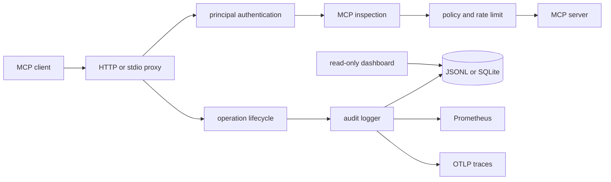

# Architecture

`mcp-audit` is a security and observability proxy for MCP servers. It is an
application, not a Go library: documented runtime surfaces are stable while
packages under `internal/` remain implementation details. See
[STABILITY.md](STABILITY.md) for the compatibility contract.

The durable JSONL or SQLite audit artifact is the evidence system. Prometheus
metrics and OTLP spans are operational views and never replace an audit entry.

## Runtime shape

```mermaid
flowchart LR
    Client[MCP client] --> Proxy[HTTP or stdio proxy]
    Proxy --> Auth[principal authentication]
    Auth --> Inspect[MCP inspection]
    Inspect --> Policy[policy and rate limit]
    Policy --> Upstream[MCP server]

    Proxy --> Lifecycle[operation lifecycle]
    Lifecycle --> Audit[audit logger]
    Audit --> Store[(JSONL or SQLite)]
    Audit --> Metrics[Prometheus]
    Audit --> OTel[OTLP traces]

    Dashboard[read-only dashboard] --> Store
```

`cmd/mcp-audit` is the composition root. It validates configuration before
starting listeners or child processes, constructs authentication, policy,
storage, signing, metrics, and telemetry components, then starts the selected
proxy transport and optional operational servers.

## Request lifecycle

For a client-originated operation, the proxy follows this sequence:

1. Bound and read the JSON-RPC input. HTTP additionally validates Host, Origin,
   request size, server timeouts, and optional client authentication. Stdio
   reads newline-delimited JSON-RPC with a bounded scanner.
2. Inspect the MCP envelope to identify the request ID, method, operation name,
   and protocol revision. When MCP metadata is repeated in HTTP headers, header
   and body values must agree.
3. Establish the principal. HTTP supports an explicit static principal, a
   pre-shared bearer token, or OIDC JWT validation. Stdio synthesizes a static
   principal from `proxy.client_id` because process ownership is the trust
   boundary.
4. Evaluate ordered policy rules. The compatibility scope is `tools_only`;
   `all_operations` extends enforcement to every client-originated MCP method.
   Principal, server, method, name, and legacy client/tool selectors can be
   combined.
5. Apply the per-`(client_id, tool_name)` token bucket to tool calls.
6. Create an audit operation before forwarding. The finalizer owns the UUIDv7
   `audit_operation_id` and guarantees at most one terminal entry for that
   accepted operation.
7. Forward the original protocol message. HTTP preserves Streamable HTTP
   session and protocol metadata while stripping hop-by-hop and sensitive
   headers by default. Stdio writes directly to the upstream child process.
8. Match or observe the upstream response and finalize the operation as
   `success`, `upstream_error`, `timeout`, `client_disconnect`,
   `malformed_upstream_response`, `cancelled`, or `internal_error`. Local policy
   and rate-limit rejections are finalized as `denied` and `rate_limited`.
9. Redact, populate defaults, compute legacy and Integrity v2 signatures, then
   append to storage. Metrics and OTLP export happen as secondary visibility.

Inspection or audit failures are reported independently and do not silently
drop or alter protocol traffic. Intentional policy and rate-limit decisions are
returned as JSON-RPC errors `-32030` and `-32029` respectively.

## Evidence and integrity

`internal/audit` defines the stable stored `Entry`, the logger, and the
exactly-once operation finalizer. Redaction occurs before signing so the stored
payload is the authenticated payload.

New signed entries contain two compatible integrity forms:

- The legacy `signature` authenticates its unchanged v1 field set.
- The additive `integrity` object identifies Integrity v2, HMAC-SHA256, and a
  key ID. Its RFC 8785 canonical payload covers the complete critical record,
  including outcome, result or error, transport direction, and authenticated
  principal, generic MCP name, and policy provenance.

`internal/audit/verify` streams JSONL or SQLite artifacts and verifies Integrity
v2 when present, otherwise the legacy signature. The `mcp-audit verify` command
returns a distinct status for valid evidence, invalid or unsigned evidence, and
usage or input errors. The exact formats are documented in
[docs/AUDIT_INTEGRITY.md](docs/AUDIT_INTEGRITY.md).

`internal/audit/storage` provides JSONL and SQLite backends plus asynchronous
and metrics wrappers. Storage writes are concurrency-safe. The async wrapper
uses bounded backpressure and returns sticky worker errors; it does not silently
discard evidence.

## Authentication and policy

`internal/auth` produces a minimal principal containing subject, client ID,
issuer, roles, and scopes. Only subject, client ID, and issuer are persisted in
the audit entry; raw JWT claims and bearer credentials are never recorded.

OIDC mode validates the JWT signature, issuer, audience, expiration, and
not-before claims against an explicit asymmetric algorithm allowlist. JWKS keys
are refreshed for rotation. HTTPS is required for remote JWKS endpoints;
loopback HTTP remains available for local development and deterministic tests.

`internal/policy` evaluates immutable, first-match rules synchronously. Empty
selectors and `*` are wildcards. Policy input comes only from trusted runtime
configuration, the inspected MCP request, and the authenticated principal.
Request-controlled headers never establish identity by themselves.

## Transport boundaries

`internal/proxy/stdio.go` coordinates the client stream, upstream process, and
pending-request map. Output writes are serialized so local JSON-RPC errors do
not interleave with upstream messages. Pending operations are finalized on
responses, expiry, pipe failure, process exit, client disconnect, or shutdown.

`internal/proxy/http.go` owns the inbound HTTP server and the outbound MCP
request. It applies body and header bounds, complete server timeouts, optional
incoming TLS, authentication, MCP metadata checks, SSE observation, and
conservative retry. `tools/call` is never retried automatically.

`internal/mcp` parses only the protocol fields needed for enforcement and
correlation. It is deliberately separate from transport code so stdio and HTTP
apply the same method/name semantics.

`internal/httpclient` centralizes outbound TLS behavior for upstream MCP and
OTLP connections: custom roots, server-name override, opt-in local insecure
mode, and optional mTLS client certificates.

## Operational components

- `internal/middleware` contains key-based JSON redaction and the concurrent
  per-client/per-tool rate limiter.
- `internal/metrics` owns the dedicated Prometheus registry and stable
  `mcp_audit_*` metric names.
- `internal/otel` exports bounded, asynchronous OTLP/HTTP trace batches. Queue
  overflow may drop telemetry, never audit evidence.
- `internal/dashboard` serves read-only audit views. It binds to loopback by
  default and can require its own bearer token.
- `internal/retry` contains bounded retry classification and backoff shared by
  HTTP integrations.

## Concurrency model

Storage backends serialize writes where required. The async audit wrapper and
OTLP exporter each own a bounded queue, one worker, coordinated shutdown, and a
wait group. Proxy pending-operation maps and rate-limit buckets are protected by
mutexes. Tests exercise these paths with the race detector.

The operation finalizer uses a once-only state transition. Competing terminal
events such as timeout and upstream completion can race, but only the winner
writes the terminal audit entry.

## Design invariants

- Every accepted operation has one terminal audit outcome.
- Enabled signing is validated before any listener or upstream process starts.
- Integrity v2 authenticates every critical stored field, including principal.
- Identity used for policy is authenticated or explicitly configured.
- Header and body MCP metadata cannot disagree.
- Audit storage is evidence; metrics and traces are derived visibility.
- `tools/call` is never retried automatically.
- Stable config, CLI, audit JSON, integrity formats, metric names, OTLP project
  attributes, dashboard APIs, and JSON-RPC error codes follow
  [STABILITY.md](STABILITY.md).

The release-specific gates and upgrade sequence are in
[docs/V1.2_SECURITY_INVARIANTS.md](docs/V1.2_SECURITY_INVARIANTS.md) and
[docs/V1.2_MIGRATION.md](docs/V1.2_MIGRATION.md).
